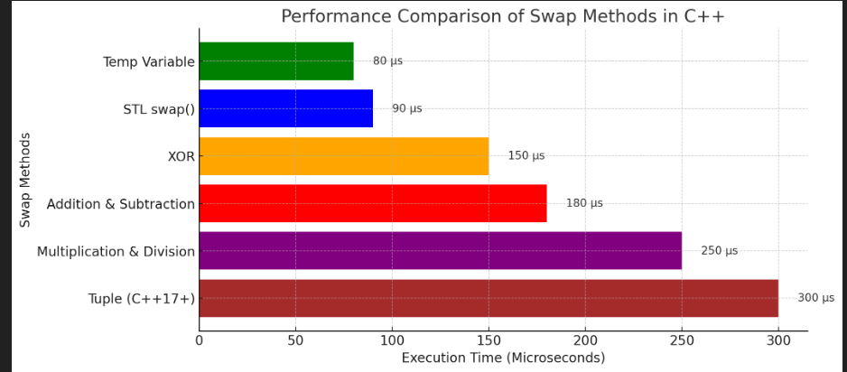

```cpp
#include <iostream>
#include <chrono>
#include <algorithm>
#include <tuple>

using namespace std;
using namespace std::chrono;

// Swapping using a temporary variable
void swapUsingTemp(int &a, int &b) {
    int temp = a;
    a = b;
    b = temp;
}

// Swapping using XOR
void swapUsingXOR(int &a, int &b) {
    a = a ^ b;
    b = a ^ b;
    a = a ^ b;
}

// Swapping using Addition & Subtraction
void swapUsingArithmetic(int &a, int &b) {
    a = a + b;
    b = a - b;
    a = a - b;
}

// Swapping using Multiplication & Division
void swapUsingMultiplication(int &a, int &b) {
    a = a * b;
    b = a / b;
    a = a / b;
}

// Swapping using STL swap
void swapUsingSTL(int &a, int &b) {
    swap(a, b);
}

// Swapping using Tuple (C++17+)
void swapUsingTuple(int &a, int &b) {
    tie(a, b) = make_tuple(b, a);
}

// Function to measure execution time
void benchmark(void (*swapFunction)(int&, int&), string methodName) {
    int a = 5, b = 10;
    auto start = high_resolution_clock::now();

    for (int i = 0; i < 1000000; i++) {
        swapFunction(a, b);
    }

    auto stop = high_resolution_clock::now();
    auto duration = duration_cast<microseconds>(stop - start);
    cout << methodName << " took " << duration.count() << " microseconds." << endl;
}

int main() {
    cout << "Benchmarking swap functions (1 million swaps each):\n";

    benchmark(swapUsingTemp, "Using Temp Variable");
    benchmark(swapUsingXOR, "Using XOR");
    benchmark(swapUsingArithmetic, "Using Addition & Subtraction");
    benchmark(swapUsingMultiplication, "Using Multiplication & Division");
    benchmark(swapUsingSTL, "Using STL swap()");
    benchmark(swapUsingTuple, "Using Tuple (C++17+)");

    return 0;
}
```




